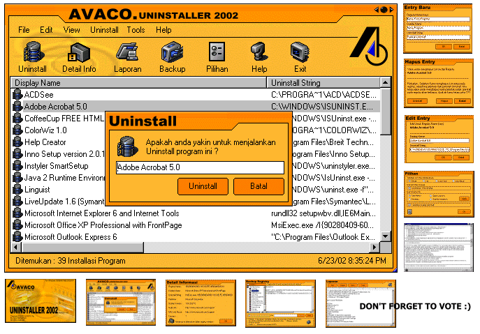



## Avaco Uninstaller 2002 \- complete add/remove program\.

### Description

Ok, this is complete program uninstaller or add/remove for windows. sorry this program

is indonesian language. But if you look this code i think you can understand. On this program you can:

- Easy to uninstaller or add/remove program

- Edit Entry on uninstall registry

- New Entry on uninstall registry

- Delete Entry on uninstall registry

- Create Backup Registry (Export and import Registry)

- Create Report about information program registry

- Look Detail Information program on registry

- Look Location Program Groups

- And any Other.....Thanks and don't forget to vote:)
 
### More Info
 

             |
---                |---
**Submitted On**   |2002-09-14 09:30:20
**By**             |[oom avaco](https://github.com/Planet-Source-Code/PSCIndex/blob/master/ByAuthor/oom-avaco.md)
**Level**          |Advanced
**User Rating**    |4.9 (94 globes from 19 users)
**Compatibility**  |VB 5\.0, VB 6\.0
**Category**       |[Windows System Services](https://github.com/Planet-Source-Code/PSCIndex/blob/master/ByCategory/windows-system-services__1-35.md)
**World**          |[Visual Basic](https://github.com/Planet-Source-Code/PSCIndex/blob/master/ByWorld/visual-basic.md)
**Archive File**   |[Avaco\_Unin1314189152002\.zip](https://github.com/Planet-Source-Code/oom-avaco-avaco-uninstaller-2002-complete-add-remove-program__1-38906/archive/master.zip)

